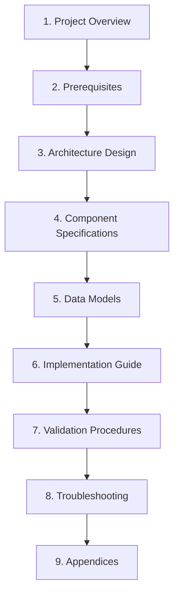
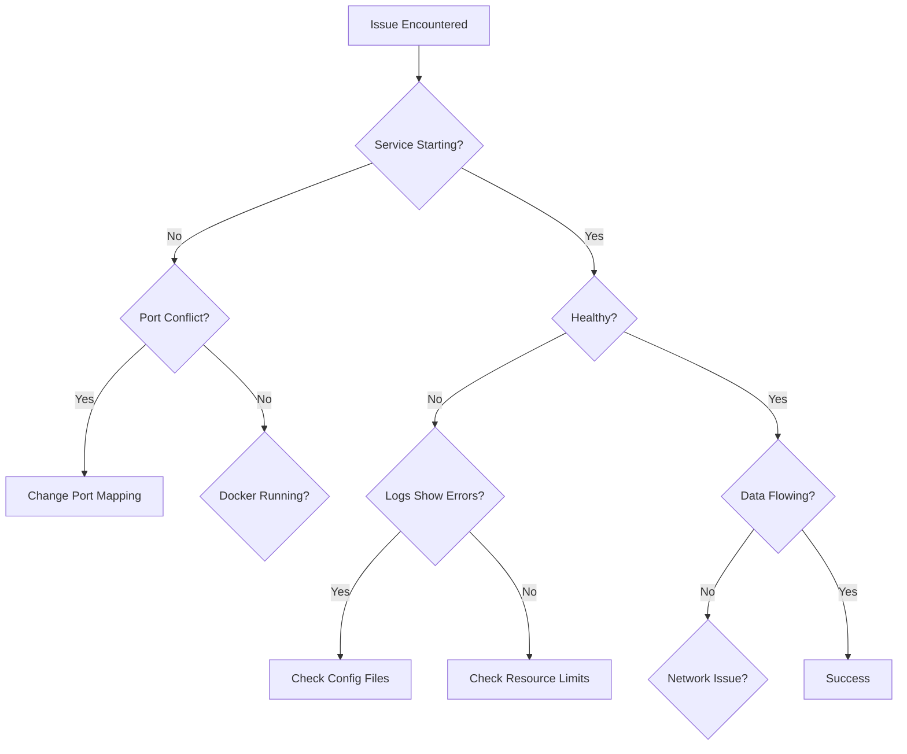

# Specification Enhancement Plan: Loki + Grafana Logging Stack for Spring Boot

## Executive Summary

This document outlines the comprehensive plan to transform the informal specification in
[`spec.md`](../spec.md:1) into a fully implementable, unambiguous technical specification that an
LLM agent can use to:

1. Create comprehensive educational documentation
2. Implement all necessary code, configuration files, and Docker setup
3. Generate a working Spring Boot sample application with JSON logging
4. Provide validation procedures and troubleshooting guides

## Current State Analysis

### Issues Identified in Current Specification

The current [`spec.md`](../spec.md:1) contains:

1. **Ambiguities**
   - "nice local way" - undefined what constitutes "nice"
   - "insenly push" (typo) - unclear mechanism for log ingestion
   - "conveniently" - no metrics for convenience defined
   - No specific log format details beyond "json lines"

2. **Missing Technical Details**
   - No component version requirements
   - No architecture diagram or data flow specification
   - No port specifications for services
   - No network topology definition
   - No volume/persistence requirements
   - No resource constraints (CPU, memory)

3. **Undefined Data Structures**
   - Spring Boot log entry schema not specified
   - Loki label structure undefined
   - Query DSL examples missing
   - Dashboard specifications absent

4. **Implementation Gaps**
   - No step-by-step execution sequence
   - Dependencies between components not explicit
   - Configuration file formats not specified
   - Integration points not detailed

5. **Validation Gaps**
   - No success criteria defined
   - No test procedures specified
   - No expected outputs documented
   - No troubleshooting decision trees

6. **Implicit Assumptions**
   - Docker/Docker Compose assumed installed
   - Network connectivity assumed
   - Disk space requirements not stated
   - OS compatibility not addressed

## Enhanced Specification Structure

### Document Organization



### Section Breakdown

#### 1. Project Overview
- **1.1 Goals and Objectives**
  - Primary: Learn Loki and Grafana for log management
  - Secondary: Local development observability setup
  - Success metrics: defined, measurable outcomes
  
- **1.2 Scope**
  - In scope: components, features, capabilities
  - Out of scope: production deployment, authentication, clustering
  
- **1.3 Target Audience**
  - Developer persona definition
  - Required skill levels
  - Learning objectives

#### 2. Prerequisites
- **2.1 System Requirements**
  - Hardware: CPU, RAM, disk space (specific values)
  - Operating systems: Windows, macOS, Linux compatibility
  - Software versions: Docker, Docker Compose minimum versions
  
- **2.2 Prerequisite Knowledge**
  - Docker fundamentals required
  - Basic Spring Boot knowledge
  - HTTP/REST API familiarity
  
- **2.3 Environment Setup Validation**
  - Commands to verify prerequisites
  - Expected outputs
  - Troubleshooting common issues

#### 3. Architecture Design
- **3.1 System Architecture Diagram**
  - Visual representation with Mermaid
  - Component relationships
  - Data flow arrows
  
- **3.2 Component Roles**
  - Grafana: web UI, visualization, dashboards
  - Loki: log aggregation, storage, query engine
  - Promtail: log collector/shipper
  - Spring Boot App: log producer
  
- **3.3 Network Topology**
  - Docker network specifications
  - Port mappings (internal and external)
  - Service discovery mechanisms
  
- **3.4 Data Flow**
  - Log generation → collection → storage → query → visualization
  - Sequence diagrams for each flow
  - Failure and retry mechanisms

#### 4. Component Specifications

##### 4.1 Grafana
- **Purpose**: Visualization and dashboard UI
- **Docker Image**: Selection criteria, official registries
- **Version Selection**: How to find compatible versions
- **Ports**: 3000 (web UI), explicit mapping
- **Environment Variables**: Complete list with descriptions
- **Configuration Files**: grafana.ini structure and options
- **Volumes**: Data persistence paths
- **Resource Limits**: CPU, memory constraints for local dev
- **Health Check**: Endpoint, expected response
- **Startup Time**: Expected duration, ready indicators

##### 4.2 Loki
- **Purpose**: Log aggregation and storage
- **Docker Image**: Selection criteria
- **Version Selection**: Compatibility with Grafana
- **Ports**: 3100 (HTTP API)
- **Configuration Files**: loki-config.yaml complete schema
- **Storage Options**: Local filesystem for dev
- **Retention Policies**: How long to keep logs
- **Resource Limits**: CPU, memory for local dev
- **Health Check**: /ready endpoint specification
- **API Endpoints**: Complete list with examples

##### 4.3 Promtail
- **Purpose**: Log collection and forwarding
- **Docker Image**: Selection criteria
- **Version Selection**: Must match Loki version
- **Ports**: 9080 (HTTP API, metrics)
- **Configuration Files**: promtail-config.yaml complete schema
- **Volume Mounts**: Log file access requirements
- **Labeling Strategy**: How to add metadata to logs
- **Resource Limits**: Minimal resources needed
- **Health Check**: Metrics endpoint

##### 4.4 Spring Boot Sample Application
- **Purpose**: Generate realistic JSON logs
- **Spring Boot Version**: Selection guidance
- **Logging Framework**: Logback with JSON encoder
- **Log Format**: JSON Lines specification
- **Log Fields**: timestamp, level, logger, message, thread, context
- **Sample Log Scenarios**: startup, request handling, errors, business logic
- **Configuration**: application.yml/properties
- **Docker Image**: Build specification
- **Ports**: 8080 (application API)

#### 5. Data Models

##### 5.1 Log Entry Schema
```json
{
  "@timestamp": "ISO-8601 format string",
  "level": "INFO|WARN|ERROR|DEBUG|TRACE",
  "logger": "fully.qualified.ClassName",
  "message": "human-readable message",
  "thread": "thread name",
  "context": {
    "application": "app-name",
    "environment": "dev|staging|prod",
    "hostname": "container-id or hostname"
  },
  "mdc": {
    "traceId": "uuid",
    "userId": "string"
  },
  "exception": {
    "class": "exception class name",
    "message": "exception message",
    "stackTrace": "formatted stack trace"
  }
}
```

##### 5.2 Loki Label Structure
- Required labels for efficient querying
- Cardinality considerations
- Best practices for label selection

##### 5.3 LogQL Query Examples
- Basic log streaming
- Filtering by labels
- Log parsing and extraction
- Metric queries from logs
- Aggregations and statistics

#### 6. Implementation Guide

##### 6.1 Implementation Sequence
```
Phase 1: Individual Component Setup
├── 1.1: Pull Docker images
├── 1.2: Run Grafana standalone
├── 1.3: Verify Grafana (UI + API)
├── 1.4: Run Loki standalone
├── 1.5: Verify Loki (API)
├── 1.6: Run Promtail standalone
└── 1.7: Verify Promtail (API)

Phase 2: Component Integration
├── 2.1: Configure Grafana datasource for Loki
├── 2.2: Verify datasource connectivity
├── 2.3: Configure Promtail to send to Loki
├── 2.4: Send test logs through Promtail
└── 2.5: Query logs from Grafana

Phase 3: Spring Boot Integration
├── 3.1: Create Spring Boot application
├── 3.2: Configure JSON logging
├── 3.3: Generate sample logs
├── 3.4: Configure log file output
├── 3.5: Configure Promtail to tail Spring Boot logs
└── 3.6: Validate end-to-end flow

Phase 4: Docker Compose Integration
├── 4.1: Create docker-compose.yml
├── 4.2: Define services
├── 4.3: Configure networks
├── 4.4: Configure volumes
├── 4.5: Test stack startup
└── 4.6: Validate all integrations

Phase 5: Documentation and Samples
├── 5.1: Create comprehensive guide
├── 5.2: Add screenshots/examples
├── 5.3: Create sample dashboards
└── 5.4: Document common queries
```

##### 6.2 Step-by-Step Instructions

Each step must include:
- **Objective**: What this step accomplishes
- **Prerequisites**: What must be completed first
- **Commands**: Exact commands to execute
- **Expected Output**: What should be seen
- **Success Criteria**: How to verify completion
- **Failure Scenarios**: Common errors and solutions
- **Validation**: How to test this step
- **Next Steps**: What to do after success

##### 6.3 Configuration File Specifications

For each configuration file:
- **File Path**: Exact location
- **Format**: YAML, JSON, properties
- **Complete Schema**: All available options
- **Required Fields**: Minimum viable configuration
- **Optional Fields**: Enhancement options
- **Defaults**: What happens if not specified
- **Examples**: Working configurations
- **Validation**: How to check syntax

##### 6.4 Docker Compose Specification

Complete [`docker-compose.yml`](../docker-compose.yml) schema:
- Version specification
- Service definitions for each component
- Network definitions
- Volume definitions
- Environment variables
- Port mappings
- Healthchecks
- Restart policies
- Resource limits
- Dependencies

#### 7. Validation Procedures

##### 7.1 Individual Component Tests

**Grafana Validation:**
- Web UI access test
- API health check: `http GET localhost:3000/api/health`
- Expected response: `{"status":"ok"}`
- Login test with default credentials
- Version verification

**Loki Validation:**
- API access test: `http GET localhost:3100/ready`
- Expected response: `ready`
- Metrics endpoint: `http GET localhost:3100/metrics`
- Query API test: `http GET localhost:3100/loki/api/v1/labels`

**Promtail Validation:**
- Metrics endpoint: `http GET localhost:9080/metrics`
- Targets endpoint: `http GET localhost:9080/targets`
- Manual log push test: `http POST localhost:9080/loki/api/v1/push`

**Spring Boot App Validation:**
- Application startup logs
- Health endpoint: `http GET localhost:8080/actuator/health`
- Generate test logs through API calls
- Verify log file creation and format

##### 7.2 Integration Tests

**Grafana + Loki:**
- Datasource connectivity
- Query execution from Grafana UI
- Dashboard creation and rendering

**Promtail + Loki:**
- Log delivery verification
- Label application correctness
- Throughput testing

**End-to-End:**
- Spring Boot generates log → Promtail collects → Loki stores → Grafana displays
- Latency measurement
- Query performance validation

##### 7.3 Acceptance Criteria

Complete stack is successful when:
1. All services start without errors
2. All health checks return positive status
3. Logs flow from Spring Boot to Grafana within 5 seconds
4. Queries return results within 2 seconds for last 1 hour
5. Dashboard displays real-time logs
6. Filtering and search work correctly
7. Stack can restart without data loss (for persisted data)
8. Resource usage stays within defined limits

#### 8. Troubleshooting

##### 8.1 Common Issues Decision Tree



##### 8.2 Diagnostic Commands

For each service, provide:
- Docker logs command
- Container inspection commands
- Network connectivity tests
- File system checks
- Process status verification

##### 8.3 Error Scenarios

Document common errors:
- **Port already in use**: detection, resolution
- **Out of memory**: symptoms, solutions
- **Connection refused**: causes, fixes
- **Configuration syntax errors**: validation tools
- **Permission issues**: Linux/Windows specific solutions
- **Version incompatibility**: detection, resolution

#### 9. Appendices

##### 9.1 Version Compatibility Matrix

How to check compatibility:
- Official documentation sources
- Docker Hub tags and descriptions
- GitHub release notes
- Community resources

Template for compatibility checking:
```
Grafana Version: X.Y.Z
├── Compatible Loki: A.B.C to D.E.F
└── Required Promtail: A.B.C (must match Loki)
```

##### 9.2 API Reference

Complete API documentation for:
- Loki HTTP API endpoints
- Promtail API endpoints
- Grafana API for datasource configuration

##### 9.3 LogQL Reference

Query language documentation:
- Syntax basics
- Operators
- Functions
- Aggregations
- Examples for common use cases

##### 9.4 Sample Dashboards

Pre-built dashboard JSON:
- Application log overview
- Error rate monitoring
- Log volume by level
- Recent errors panel

##### 9.5 Resource Requirements

| Component | CPU | RAM | Disk | Network |
|-----------|-----|-----|------|---------|
| Grafana | 0.5 core | 256 MB | 100 MB | Low |
| Loki | 1 core | 512 MB | 1 GB+ | Medium |
| Promtail | 0.25 core | 128 MB | 50 MB | Low |
| Spring Boot | 0.5 core | 512 MB | 100 MB | Low |
| **Total** | **2.25 cores** | **1.4 GB** | **1.25 GB** | - |

##### 9.6 Performance Targets

For local development environment:
- Log ingestion rate: 100 logs/second minimum
- Query response time: < 2 seconds for 1 hour window
- Dashboard refresh: < 1 second
- Startup time: < 30 seconds for entire stack
- Memory footprint: < 2 GB total

##### 9.7 Operational Procedures

**Starting the Stack:**
```bash
docker-compose up -d
docker-compose ps
docker-compose logs -f
```

**Stopping the Stack:**
```bash
docker-compose down
docker-compose down -v  # with volume cleanup
```

**Viewing Logs:**
```bash
docker-compose logs grafana
docker-compose logs loki
docker-compose logs promtail
docker-compose logs spring-boot-app
```

**Updating Configurations:**
```bash
docker-compose restart <service-name>
docker-compose up -d --force-recreate <service-name>
```

## Implementation Deliverables

The LLM agent will create the following artifacts:

### Documentation
1. **README.md** - Main guide with all sections above
2. **ARCHITECTURE.md** - Detailed architecture diagrams and explanations
3. **TROUBLESHOOTING.md** - Comprehensive troubleshooting guide
4. **API_REFERENCE.md** - Complete API documentation

### Configuration Files
1. **docker-compose.yml** - Complete stack definition
2. **loki/loki-config.yaml** - Loki configuration
3. **promtail/promtail-config.yaml** - Promtail configuration
4. **grafana/grafana.ini** - Grafana configuration (optional)
5. **grafana/datasources/loki.yaml** - Datasource provisioning

### Code Artifacts
1. **spring-boot-app/pom.xml** or **build.gradle** - Build configuration
2. **spring-boot-app/src/main/** - Application source code
3. **spring-boot-app/src/main/resources/application.yml** - App configuration
4. **spring-boot-app/src/main/resources/logback-spring.xml** - Logging configuration
5. **spring-boot-app/Dockerfile** - Container build specification

### Supporting Files
1. **.env.example** - Environment variable template
2. **sample-logs.json** - Example log entries
3. **sample-queries.lql** - Example LogQL queries
4. **dashboards/app-logs.json** - Pre-built dashboard
5. **scripts/verify-stack.sh** - Automated validation script

## Success Criteria for Enhanced Specification

The enhanced specification will be considered complete when:

1. **Zero Ambiguity**: Every requirement has exactly one interpretation
2. **Fully Testable**: Every feature has defined success criteria and test procedures
3. **Deterministic**: Same inputs always produce same outputs
4. **Complete**: No external information needed for implementation
5. **Sequenced**: Clear order of operations with dependencies explicit
6. **Validated**: All steps include verification procedures
7. **Error-Handled**: All failure scenarios documented with solutions
8. **Type-Safe**: All data structures fully specified with types
9. **Measurable**: All quality attributes have numeric targets
10. **Reproducible**: Any LLM agent can implement identically from spec alone

## Risk Assessment and Mitigation

### Technical Risks

1. **Version Incompatibility**
   - Risk: Components may not work together
   - Mitigation: Specify version discovery process, provide compatibility checking procedures

2. **Resource Constraints**
   - Risk: System may not have enough resources
   - Mitigation: Define minimum requirements upfront, provide resource monitoring

3. **Configuration Errors**
   - Risk: Complex YAML configurations may have errors
   - Mitigation: Provide validation commands, include schema references, give complete examples

4. **Network Issues**
   - Risk: Container networking may fail
   - Mitigation: Document network topology, provide connectivity tests

### Implementation Risks

1. **Incomplete Instructions**
   - Risk: Steps may be unclear for LLM agent
   - Mitigation: Break down into atomic operations, provide expected outputs for each step

2. **Implicit Knowledge**
   - Risk: Assumptions not made explicit
   - Mitigation: Document all prerequisites, define all terms, explain all concepts

3. **Diverse Environments**
   - Risk: Works on some systems but not others
   - Mitigation: Specify OS-specific instructions, provide troubleshooting for each platform

## Next Steps

1. Review this plan for completeness and accuracy
2. Confirm scope and approach
3. Switch to code mode to implement the enhanced specification
4. Generate all documentation and implementation artifacts
5. Validate specification completeness and implementability

## Questions for Clarification

Before proceeding to implementation, confirm:

1. Should the specification include Windows-specific instructions (PowerShell commands) or focus on Unix-like systems?
2. Should sample dashboards be extensive or minimal?
3. What level of Spring Boot complexity (simple REST controller vs. more realistic business logic)?
4. Should the guide include optional advanced topics (retention policies, performance tuning) or keep it minimal?
